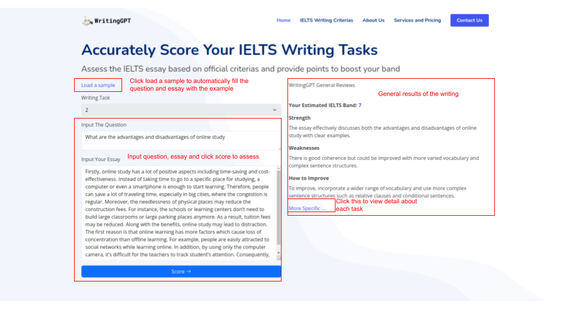

# writingGPT
## Presquites
```
python=3.8
```
## Installation
```bash
pip install -r requirement.txt
```

## Run the app
```bash
python app.py
```
The app will run on http://127.0.0.1:8092
### Please read the api document on `documents/score_essay.md` for detail about the BE Scoring API

## Simple Demo

